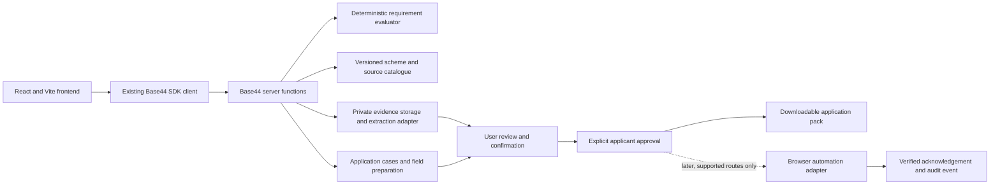

# GrantPath build plan

## Product goal

Help people in Ireland find housing support they may qualify for, understand what is known or unresolved, and prepare a complete application with less repeated paperwork. GrantPath provides guidance and preparation; the relevant local authority or scheme administrator decides eligibility and approval.

The product should work in stages. A person can explore without uploading documents, save a profile if they choose, prepare a case with evidence, and review every proposed application answer before they act.

## Product principles

1. Explain each possible match using current official sources.
2. Treat scheme criteria as explicit, versioned rules rather than asking a language model to decide eligibility.
3. Keep confirmed facts, missing answers, extracted suggestions, and uncertain details distinct.
4. Ask only for information needed for the selected scheme and authority.
5. Make document use and reuse visible and user controlled.
6. Label an application as prepared until a reliable acknowledgement confirms submission.
7. Keep a person in control of declarations, signatures, and final submission.

## Initial scope

### Include in the first useful release

- Ireland-focused housing support catalogue with a small, curated set of schemes.
- Official source links, retrieval dates, and named administering authorities.
- Short questionnaire that works without an account or document upload.
- Deterministic matching with requirement-by-requirement results:
  - `met`
  - `not_met`
  - `missing`
  - `needs_confirmation`
  - `not_applicable`
- Plain-language explanation of what is known, why, and what to do next.
- Optional account and saved profile, with clear consent before persisting answers.
- Scheme and local-authority-specific readiness checklist.
- A dashboard that distinguishes recommended schemes, drafts, and verified submissions.

### Defer until the first release is reliable

- Voice conversation.
- Broad automated crawling of scheme websites.
- Automated browser interaction or submission through Steel.
- Automatic declarations, signatures, or unattended application submission.
- Eligibility percentages or guaranteed approval language.
- Nationwide coverage of every housing and non-housing benefit.
- Cross-user case sharing or professional adviser workflows.

## Proposed system shape

The existing `src/api/base44Client.js` remains the frontend entry point. Scheme matching and document processing run in Base44 functions, not in browser components. Provider-specific AI, OCR, storage, and browser code sit behind server-side adapters so they can be changed without rewriting the product flow.

## Core records

| Record | Purpose | Key rules |
| --- | --- | --- |
| SupportScheme | A support programme and its administering authority | Stable ID, geographic scope, application route, status |
| SchemeRequirement | One criterion or application requirement | Versioned, testable, source-backed, plain-language explanation |
| SourceSnapshot | Evidence behind scheme facts | Official URL, title, captured date, content hash, relevant excerpt |
| UserProfile | Reusable person or household facts | Each fact records origin, confirmation state, and last-confirmed date |
| SupportMatch | Evaluation for a profile and scheme | Per-requirement status, facts used, source IDs, and next action |
| ApplicationCase | Readiness work for one scheme and authority | Checklist status and application lifecycle |
| EvidenceDocument | Uploaded evidence metadata and processing state | Private access, purpose, retention/deletion state |
| ExtractedFact | Proposed values found in evidence | Document/page provenance; never confirmed automatically |
| ApplicationField | A supported form field and proposed value | Value provenance, review status, applicant-action requirement |
| SubmissionRecord | A verified submission event | Prepared/submitted distinction, channel, timestamp, acknowledgement |
| AuditEvent | Sensitive actions taken in a case | Append-only record of consent, access, confirmation, approval, and deletion |

User-owned records must be restricted to their owner. Shared scheme catalogue records are read-only to ordinary users. Represent family-member cases with an explicit subject and helper relationship; do not infer that an account holder has authority over another person's data.

## Backend contracts

- `findSupports(profileAnswers)`: return candidate schemes and missing high-value facts.
- `matchSupports(profileAnswers, schemeId?)`: return per-requirement evaluations, sources, and next actions.
- `supportDetails(schemeId)`: return scheme metadata, current requirements, source references, and official application route.
- `buildReadiness(schemeId, authority, confirmedProfile)`: create or refresh a personalized checklist.
- `uploadEvidence(caseId, file)`: store a private document and return processing state, not extracted facts as confirmed answers.
- `extractEvidence(documentId)`: return proposed facts with page-level provenance and uncertainty.
- `confirmFacts(caseId, factIds, corrections)`: record which proposed facts the user reviewed and confirmed.
- `prepareApplication(caseId)`: fill supported fields from confirmed facts and approved evidence; stop on unresolved required fields.
- `downloadApplicationPack(caseId)`: produce the prepared draft and remaining action list where direct form support is unavailable.
- `submitApplication(caseId, approval)`: future adapter only; require scoped, explicit approval and store a verified acknowledgement before showing submitted.

Use shared input/output validation and stable error codes. Never expose provider keys to the frontend. Never send document contents or application payloads to logs.

## Build phases and exit criteria

### Phase 0 — Foundation and decisions

- Keep the generated Base44 app and its current auth conventions.
- Establish an agreed data vocabulary and function response shapes.
- Decide how guest exploration, account persistence, and helper access work.
- Select a narrow first set of housing schemes and authorities from official sources.
- Confirm who maintains scheme content and how stale sources are detected.

**Exit:** reviewed architecture, initial source register, and a deliberately small pilot scope.

### Phase 1 — Scheme catalogue and matching

- Define SupportScheme, SchemeRequirement, and SourceSnapshot entities.
- Manually encode a small set of verified official requirements.
- Implement deterministic matching, including boundary cases and missing information.
- Return requirement-level reasons, citations, and next questions.
- Connect the existing Search experience to the function contract.

**Exit:** a user can enter basic facts and see explainable results without an account or upload; no scheme-level answer hides an unresolved requirement.

### Phase 2 — Profile and readiness cases

- Add optional consent-based saved profiles.
- Add ApplicationCase and personalized checklists.
- Separate confirmed, missing, needs-confirmation, and not-met items.
- Add family-member assistance only with explicit subject/relationship controls.
- Add dashboard status for recommended, in progress, prepared, and submitted.

**Exit:** a user can reopen a case and see the next required action without re-entering confirmed facts.

### Phase 3 — Evidence and preparation

- Add private upload, retention, and deletion flows.
- Extract candidate facts with document/page provenance.
- Provide a correction and confirmation step before reusing extracted values.
- Map confirmed facts to a small number of known form fields.
- Generate a downloadable pack when a form cannot be safely automated.

**Exit:** every populated field can be inspected and traced to a user-confirmed source; unresolved required values block preparation.

### Phase 4 — Pilot and operational readiness

- Pilot with a small, reviewed set of schemes and users.
- Track source freshness, broken links, matching corrections, completion friction, and user-reported errors.
- Add accessibility, security, backup, retention, incident, and support procedures appropriate to the pilot.
- Establish catalogue review ownership and a process for official scheme changes.

**Exit:** team has reviewed pilot feedback and can maintain sources and support user data responsibly.

### Phase 5 — Optional browser agent

- Evaluate Steel or another browser provider against the limited supported application routes.
- Show the live browser activity and exact fields being entered.
- Keep application submission disabled until all required fields and attachments are reviewed.
- Require a fresh, case-scoped user approval for the exact submission.
- Verify an authority acknowledgement before changing status to submitted.
- Fall back to the downloadable pack whenever the route is unsupported or uncertain.

**Exit:** a supported route has a tested recovery path, observable activity, explicit approval, and reliable evidence of submission.

## Hosting and release plan

### Initial development

Follow this repository's Base44 workflow: use `base44 dev` for local frontend plus local functions/entities, and keep uploaded files and personal data out of fixtures. Local Base44 entity data is in-memory and resets on restart. Avoid `base44 dev --remote` for routine work because repository setup notes say that mode writes to hosted production data.

### Vercel evaluation

The frontend uses Vite, which Vercel supports as a Git-connected project. The proposed first Vercel use is a Preview deployment for a non-production branch or pull request. Keep Base44 as the backend during this evaluation.

Before using Vercel as the production frontend, verify on a Preview URL:

1. Base44 app settings load and auth/login redirects work from the Vercel origin.
2. SDK calls to Base44 functions work with the intended CORS/origin configuration.
3. Preview and production configuration can point to the right Base44 app without exposing secrets.
4. Direct navigation to React routes works after refresh.
5. No test or demo data can be written to the production Base44 app.

If any of these fail or depend on unsupported Base44 hosting behavior, publish the app through Base44 Builder first and revisit the hosting split with evidence. Do not run two production frontends as competing sources of truth.

### Release flow if the preview evaluation succeeds

- Connect `tanamsethi31/GrantGuide` to a Vercel project.
- Set the Vercel root directory to the repository root and use the existing Vite build command and output.
- Let pull requests create Preview deployments; review the actual Preview URL before merge.
- Keep production tied to `main`, with Vercel environment variables separated for Preview and Production.
- Keep secrets in Vercel/Base44 configuration, never in Git or `VITE_*` variables. Only public configuration belongs in frontend-exposed variables.
- Use Base44's supported publish/sync process for backend functions and entities; Vercel hosts the frontend only.
- Add a custom domain only after auth, function calls, routing, and rollback have been confirmed.
- Keep a simple rollback path to the previous frontend deployment and document how to disable or revert a bad backend change.

The current README documents Base44 Builder publishing and warns that its CLI deploy bypasses the Git sync workflow. Treat that as the backend release process until the team deliberately changes it.

## Environments and data handling

| Environment | Frontend | Backend/data |
| --- | --- | --- |
| Local | `base44 dev` frontend | Local Base44 functions; ephemeral entity data |
| Preview | Vercel Preview if integration succeeds | Isolated preview Base44 app/configuration, or no writes |
| Production | One chosen public frontend host | Production Base44 app and user data |

A separate preview Base44 app is preferred before real user data exists. Never point PR previews at production writes. Add environment variables through the platform dashboards or secure CLI pull; do not commit `.env.local`, Base44 app IDs, tokens, or Vercel project credentials.

## Quality gates

For each phase, define checks around:

- requirement rules and edge cases;
- citations and source freshness;
- access control between users and helper cases;
- route and form behavior;
- extraction corrections and provenance;
- deletion and retention behavior;
- keyboard/screen-reader use and clear status wording;
- frontend Preview-to-production parity.

The implementation should make “prepared” and “submitted” impossible to confuse in the UI and persisted state.

## Decisions to revisit

1. Does the first pilot support all of Ireland or selected authorities?
2. Which three to five schemes are in the curated catalogue?
3. Does Base44 support the necessary isolated preview backend and Vercel-origin auth/function calls?
4. Which files can be parsed reliably, and which should only be attached to a human-prepared pack?
5. What retention period and deletion behavior should apply to original files and extracted facts?
6. Which supported application route, if any, is safe enough to automate first?
